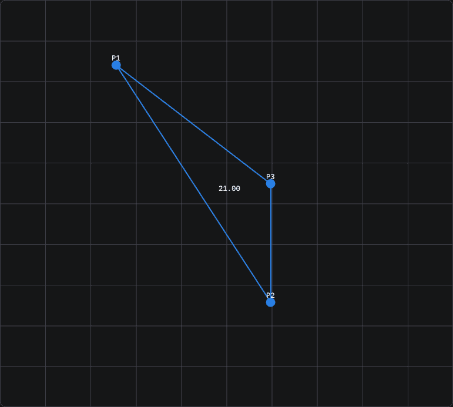
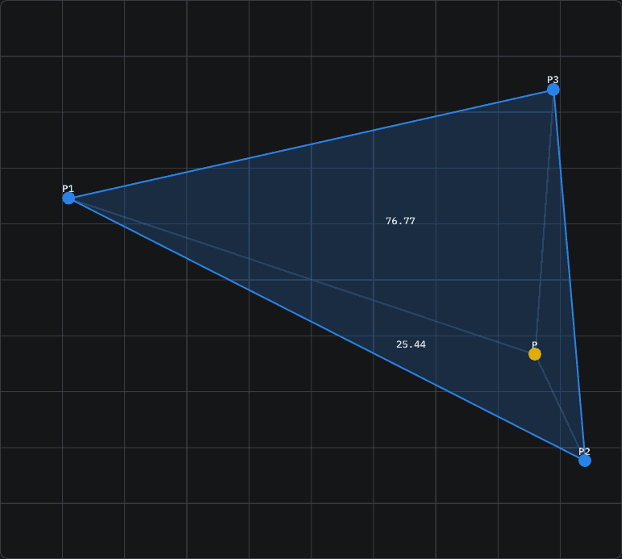
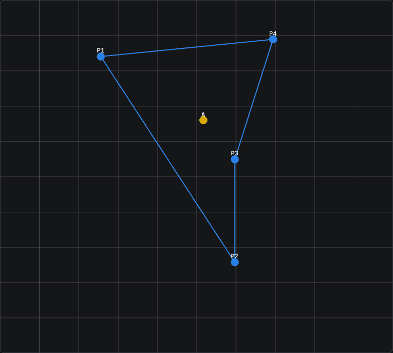
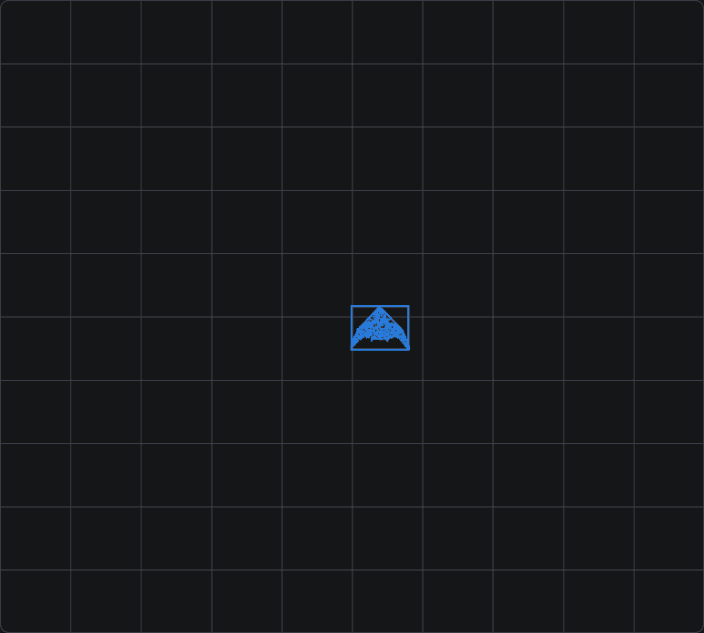
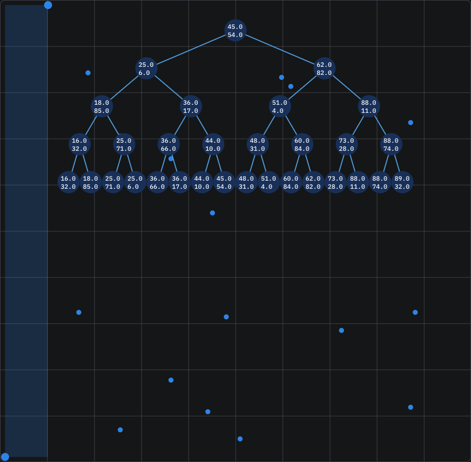
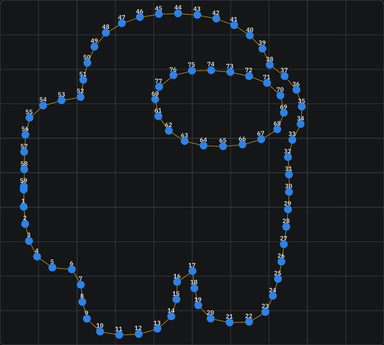
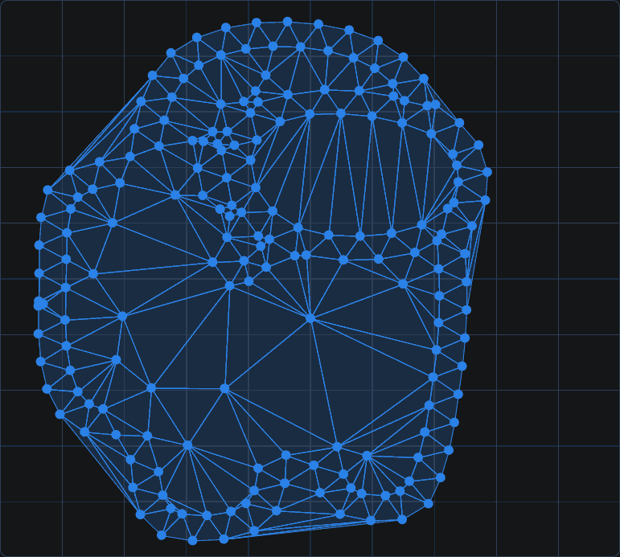
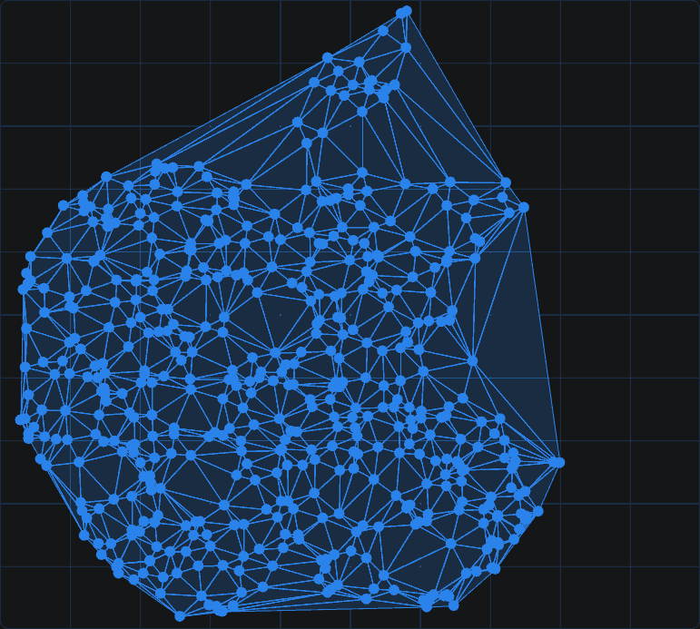

# Computational Geometry
### This is a repo with all the *mini-projects* I wrote for my university class "*Computational Geometry*"

## About the code
Everything You see when running the code is C++, but in some cases I had to use Python, mostly to extract a list of points from an image. The UI is in Polish,
but the code itself is (mostly) kept in English. 
Let's be real, not everything is commented, because, as we all know, "a good code doesn't need comments"... 
I do not plan on ever updating this repo with new features, because all the *features* are just exercises I had to do.

## How is it made?
I made it on OpenGL (for cross-platform support) and glfw.
For the GUI library I used a trusted, fast and responsive [ImGui](https://github.com/ocornut/imgui). 
For anyone trying to do these kind of things, just to pass the class, I would recommend very different ways from mine, mostly javascript or python. 
This is not what I wanted to do, so I spent more time on every project in hopes I'll learn something (I did).

### This repo consists of 7 parts (and a final project (different repo)), each is called lab0X. Here's a more detailed list of them:
1. [Straight line (equation, translation, reflection, etc.), Point representation.](#some-basic-lines-and-points-interactions)
2. [- Continuation - Triangle from 2 lines](#3-lines-given-by-equations-forming-a-triangle)
3. [Polygon / Triangle (area / hit checks)](#triangle-area)
4. [Convex hull, collision detection](#convex-hull)
5. [1D/2D Range Trees](#2d-range-tree-sorting)
6. [Advancing Front / Mesh Generation](#advancing-front-algorithm-mesh-generation)
7. [Delaunay and it's *derivatives*](#base-delaunay-mesh-generation)
8. [Final Project (*Team*-Project)](https://github.com/AndyFilter/VoronoiCityAnalysis)

# Detailed Showcases / Descriptions

  
Lab 1 and 2

### Some basic lines and points interactions

### 3 lines given by equations forming a triangle

*More stuff that is just too simple / boring to show off is in the program itself**

  
Lab 3

### Triangle Area

### Triangle-Point Check

### Polygon-Point Check

*Again, there is a bit more here, it's just pretty boring**

  
Lab 4

### Convex Hull

### Starfleet (game)

  
Lab 5

### 2D Range Tree (*sorting*)

*When You hover over a node it shows You the y-axis of that subtree*

  
Lab 6

### Advancing Front Algorithm (mesh generation)

*There also is a way to export and import generated meshes**

  
Lab 7

### Base Delaunay mesh *generation*

### Weighted + Smoothed Delaunay mesh *generation*

# How to run
The code is adapted to run on Windows and Linux. I was mostly running it on Linux, but I checked all the sub-projects afterwards on Windows. 
It's not a Visual Studio project! It's just a cmake project that I coded in IDE that I like :) 
To run, just use cmake or an IDE that You like :] (that supports cmake).
When it comes to the couple of python scripts scattered across all folders, You'll just have to install all the dependencies manually,
but there are not many of them, and the ones I chose to use are very common ones.

# Licence
Feel free to use it in educational purposes, if You think some of my visualizations can help convey how a given algorithm works, then use it.
Record a video, a gif, do a live presentation. Whatever helps people understand the beauty of **Computational Geometry <3**

# Hope it helps!
Or at least You enjoyed looking at the animated gifs...

